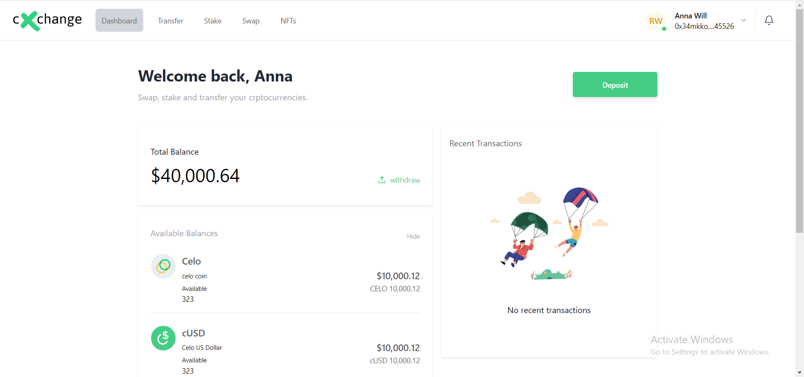

## Learn More

### About FiatConnect
A common source of contension for emerging crypto networks is the cash flow between fiat and cryptocurrency asstes. Some of the reasons for this friction are;

1. Poor support for geographical regions and extremely high fees.
2. Liquidity providers share no common interface to allow their clients to transfer funds between crypto and fiat.

FiatConnect is one possible solution to these problems. FiatConnect offers a standardized server-side specification for liquidity providers to provide users with cash in/cash out functionality.

---

---
### What is cXchange?
cXchange is a practical application that was created to demonstrate the simplest and fastest way to handle this issue being encountered by several liquidity providers and their consumers by creating a functionality that performs on ramp/off ramp operations across various locations with no stress.